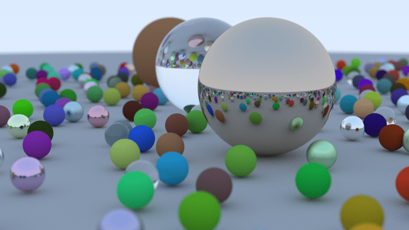

# Raytracing In A Weekend(Rust)

My initial attempt at implementing raytracing in rust (from [Raytracing in A Weekend](https://raytracing.github.io/books/RayTracingInOneWeekend.html)). This is an almost literal translation from C++ to Rust, which was a pain to write.

# Things To-Do (later)

1. Complete re-write in idiomatic rust (once i get a hang of it :/)
2. Parallelism (the .ppm image takes too much time to render)
3. Render more textures and different shapes
